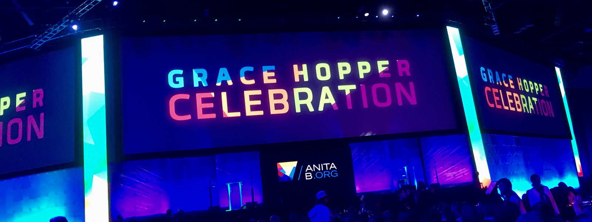

*This year, I was fortunate enough to receive the BRAID ICS Scholarship to attend the Grace Hopper Conference. So, first and foremost, I would like to thank the BRAID Initiative, the Donald Bren School of Information and Computer Sciences, and WICS for giving me this opportunity.*

As a freshman and a first-timer to the largest gathering of woman technologist, feeling overwhelmed was an understatement. There were thousands of women from all over the world coming to the conference for different reasons, whether it was to look for an internship or career, network, or learn more about their field of interest. For me, it was to explore and see what a conference was like. I attended various sessions, workshops, and company booths...

## Tuesday, September 29

## Wednesday, September 30

## Thursday, October 1

## Friday, October 2

## Saturday, October 3

## Words of Wisdom
Throughout the conference, there were special guest speakers who would open and close each day with a keynote. Although I was unable to attend all of them, there was still an abundance of words of wisdoms and inspiration shared by some amazing women leaders. Here are some of my favorite thoughts, advice, and quotes.

### Marian Croak
#### *Chief Troublemaker, VP of Site Reliability Engineering at Google*
> "I didn't have to be perfect. I didn't have to fit in. All I had to do was what was right for the business."

> "I also soon learned that I had to become an advocate for myself, and that was a much more painful and difficult lesson."

> "There are times when you're going to want to quit or disengage. Sometimes, you'll hurt so bad that you're going to want to hurt someone. Try to harness that energy and give voice to your concerns. Correct the problem and speak out for yourself."

### Megan Rapinoe
#### *2x World Cup Champion and Activist*
> "Women are inherent leaders. We are already doing it."

> "We need to push for diversity and inclusion, not so we can tick off boxes, but to see the bigger picture."

> "The world motto of women is 'Get sh\*t done.' We know how to get stuff done."
(Hang's note - please excuse for the language)

## Concluding Thoughts
