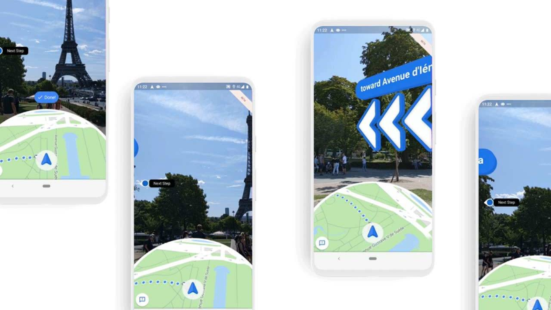

*This year, I was fortunate enough to receive the BRAID ICS Scholarship to attend the Grace Hopper Conference. So, first and foremost, I would like to thank the BRAID Initiative, the Donald Bren School of Information and Computer Sciences, and WICS (Women in Information and Computer Science, an organization at UCI)  for giving me this opportunity.* 🥳

There were thousands of women from all over the world coming to the conference for different reasons, whether it was to look for an internship or career, network, or learn more about their field of interest. For me, it was to explore and see what a conference was like. I attended various sessions, workshops, and company booths. Although I did not get to network much or meet one-on-one with any recruiters, I still enjoyed my first Grace Hopper Conference. 

## Sessions
With hundreds of sessions and workshops overall, it was difficult to choose which to attend. In the end, I went for ones that piqued my interest, watching as many as I could with adequate breaks in between. Luckily, the on-demand content makes it easier to go back and watch the many sessions. Here are some of my highlights. Images are kept to a minimum to respect the presentation of the speakers.

---

### 🌐 **Code Your Technical Portfolio** - *Jacqui Grindrod, Rachel Sharp, Rosemary Wang (HashiCorp)* 

First, I want to highlight this workshop hosted by HashiCorp that made this actual website possible! I don't have any experience with making my own website or portfolio, so when I saw this workshop, I knew I had to attend. I remember logging on to the Zoom link 45 minutes early just to make sure I secured my spot before spaces filled up. 

Even for me, the [template repository](https://github.com/joatmon08/tech-portfolio) made everything very easy! All I had to do was fork the repository and follow the instructions in the `README.md` file. I got the website up and running in less than 5 minutes. The instructions were simple enough that I could go ahead and update the website to have my information, such as my name, tagline, color preference, and social media links. This website was made using [Docusaurus](https://docusaurus.io/en/ "Docusaurus Documentation") and [Markdown](https://github.com/adam-p/markdown-here/wiki/Markdown-Cheatsheet#blockquotes "Markdown Cheat Sheet").

### 🧚 **Streaming Infrastructure: Building Software Solutions & Delivering Content at the Edge** - *Vidya Mane, Alima Wolfson (Disney)*

With this session, I got an inside look at the process of how Disney+ users can get the content on their devices. It starts with the user's request for specific content. That request would find its way to the origin server that contains all the Disney+ shows, and the origin server would respond to the client with the requested content. To facilitate the process and prevent overloading the origin server, there are content delivery networks (CDN) that stand between the user request and the origin server, and there are midteirs in between the CDN and the origin. Clients would connect to different CDN depending on their point of presence (PoP) determined by their location. Essentially, the midteirs and CDN tries to see if the content has already been requested. If it has, the content has already been pre-loaded, so there is no need to go to the origin server. If it has not, the request makes its way to the origin server to load it.

### 🗺️ **Developing Live View for Google Maps: A Lesson in Working With Emerging Technologies** - *Rachel Inman, Wenli Zhao (Google)*

Google has recently added a great new feature to Maps to help people find their ways. When exploring new places, it can be difficult to pinpoint which way to face or where to looking for the next turn. This is especially true in urban cities with bustling streets where you can easily get lost or swept away. Because of the many buildings, GPS location can be slightly off, which can make you end up in a different location. 

To make navigating easier, Google introduced Live View, using localization and AR to better pinpoint your location and visualize your path. Google Maps was able to use machine learning,  computer vision, and landmarks to detect where users were by comparing their surroundings to the Street View database. Then, with the use of ARCore, Google Maps provides users with arrows on where to go next. 

Throughout the development process, Google ran into many problems, such as how they wanted the visuals to look and incorporating the prototype with the existing application. It took lots of testing with people to find which visuals worked best for users and to keep the application in sync across platforms. 

Overall, I enjoyed being at this session and seeing the challenges the design and engineering teams faced and how they overcame those problems to produce such an innovation feature.

### 👩‍💻 **Legacy of Women in Computing** - *Sheila Tejada (Computing Savvy Research Group), Vidya Srinivasan (Microsoft)*

One of the most inspirations sessions I attended was this one, where I got to hear about the many talented women in technology that came before me and the legacy they left behind. 

**

### 🧍 **Wearable Technology to the Rescue: Human-Computer Interaction via Oral Assistive-Devices** - *Hananeh Esmailbeigi (HideIT Wearables LLC)*

With technology constantly developing, one of its greatest purposes is to help people in need, especially those with disabilities. There are head and gaze trackers to pinpoint where someone is looking on a virtual keyboard. There are voice recognition and predictive to help people better communicate.

Recently, there was the development of using a person's tongue to type. First, there was the user interface cursor-controller (U-UIC), a Bluetooth device people would wear over their teeth. The device would connect to a cursor on a screen, and users would move their tongue around to move the cursor and type out words. However, this technology resulted in taking more time to type out phrases. After came the oral-user interface controller (O-UIC) that implemented the phone keypad with eight contact pads. 

In comparison to existing technology like the gaze tracker or a mouth sticker, the O-UIC was pretty average, and in comparison to voice recognition, it still had a long way to go. However, of the users surveyed, a majority of them believed the Tongue Trackpad would help in their daily lives. 

### 💪 **To Succeed Faster, Get Comfortable With Risk** - *Aimee Cardwell (Optum Financial Services)* 

While there were many sessions about technology, there was also an abundance of sessions focusing on soft-skills and self-care. One of them was about getting comfortable with taking chances and building self-confidence. To grow and advance in life, we need to be willingly taking risks and accepting any consequences that come with it. The more we push ourselves to try, the sooner we'll see our capabilities. Here are some takeways from the talk. 

- Build confidence towards large risks by taking smaller risks. Ask for what you want.
- Play to win instead of playing not to lose.
- A career is not built on the daily judgment of each small success and failure. When something goes poorly, ask why. 
- Speak openly about the failures you've experienced and own them.
- Change what it means to win. Not every situation is win/lose. Most can be win/win if you find the compromise.
- Avoid analysis paralysis. If it was easy to know whether a project would succeed or fail, there would be no need for a leader.
- Emulate risk-tolerant leaders. Observe great leaders and copy their best traits.

### 💼 **Cracking the Internship Code** - *Mariana Briones, Alejandro Davila (InternMakers)* 

As a way of helping college students start their technical careers, Mariana and Alejandro held a workshop and gave advices on how to get an internship. They provided a starting point for undergraduates on their internship search, with a complied list of freshman/sophomore programs and of software companies and startups. Mariana and Alejandro showed us how to keep track of recruitment season with a simple framework. 

The speakers also walked us through crafting an elevator pitch and even gave one on the spot as an example! They introduced us to the STAR method used for interviewing in addition to tips and tricks on preparing for technical and behavioral interviews. What I found most helpful was their framework for researching companies, their location, products, and mission or vision. I found that doing so makes it easier to see whether or not I want to work at a specific company, and it also prepares me for a career fair or interview. 

All the resources provided were compiled into this helpful [guide](http://bit.ly/internship-resources-handout "A Crash Course on How to Get an Internship in Tech")!

### 🍎 **Software Testing — Emerging Challenges in Industry** - *Emily Kowalczyk, Sahana Gururaj (Apple)*

While companies like Apple are always producing and updating software, there are many emerging challenges in software testing to meet with the increasing demands.

**Rapidly shrinking release cycles** 

As demand for updated software continues to rise, the release cycles have gone from being yearly, to monthly, to even daily. With tighter deadlines, the software is prone to more bugs in the code. Every time edits are made, tests are run in an attempt to detect those errors. However, with the thousands of tests necessary to ensure the software runs successfully, quality assurance can take several hours and days, given that everything is correct. 

To reduce runtime, repositories have been edited to have certain types of edits to test only what has been changed. Instead of running all thousands of tests, only the ones that currently relate to the changes run. 

**Novel test strategies**

With the complexity of software, machine learning components are needed to test all of the developing software. However, it becomes difficult to interpret output from these testing strategies due to the complicated neural networks. Consequently, testers have no way of making sure all aspects of the code have been covered and which tests are running and testing which code block. 

To better comprehend the results from ML testings, clustering was implemented. Each test was grouped based on the test type and the ending result of pass or fail. With this cluster, it becomes easier to see which edits and tests were successful.

## Words of Wisdom
Throughout the conference, there were special guest speakers who would open and close each day with a keynote. Although I was unable to attend all of them, there was still an abundance of words of wisdom and inspiration shared by some amazing women leaders. Here are some empowering thoughts, advice, and quotes from throughout the conference. 🙌

---

😏 **Marian Croak** *Chief Troublemaker, VP of Site Reliability Engineering at Google* 
> "I didn't have to be perfect. I didn't have to fit in. All I had to do was what was right for the business."

> "There are times when you're going to want to quit or disengage. Sometimes, you'll hurt so bad that you're going to want to hurt someone. Try to harness that energy and give voice to your concerns. Correct the problem and speak out for yourself."

> "If you want to change things, you have got to be comfortable with being on the edge."

> "Find that one empowering supporter, and everything is going to be okay."

⚽ **Megan Rapinoe** *2x World Cup Champion and Activist* 
> "Women are inherent leaders. We are already doing it."

> "We need to push for diversity and inclusion, not so we can tick off boxes, but to see the bigger picture."

> "The world motto of women is 'Get sh\*t done.' We know how to get stuff done." (Hang's note - please excuse for the language)

🎧 **Mariana Briones** *Co-Founder at InternMakers and Program Manager at Microsoft*
> "Rejection is just a redirection."

🖥️ **Anita Borg** *American computer scientist and founder of the Grace Hopper Celebration*
> "Women transform technology, and technology transforms the world."

## Concluding Thoughts 
As a freshman and a first-timer to the largest gathering of women technologists, feeling overwhelmed was an understatement. On the days before the conference, I spent stressing out about how to make the most of the event. Which session should I go to? How do I network? How do I interact with recruiters? Should I even be going to this conference? Although it was amazing to be attending the same conference as thousands of other women, I couldn't help feel small and clueless. However, with the socials held by WICS to help students prepare, it felt better to see many others also share the same concerns. 

It was difficult, but I had to tell myself to just enjoy the opportunity. Even if I don't get to network, there were still tons of knowledge being shared for me to take advantage of. I've learned about so many new emerging technologies and felt inspired by all of the speakers. I didn't worry about whether or not I got my foot through the door through this conference. I just had fun listening to women talk about pursuing their passion and the projects they got to work on as a result. The entire event was a celebration of women and the extraordinary work they have done to contribute to this growing field. 

All in all, I am glad I got the chance to experience this celebration, and I look forward to attending more in the future. 
